# Betse 
API Gateway is a problem scenario (change C4)

# Both
1. Load balancing on the architecture (change C4)
   - not cluster (kubernetes) cause node is just a PC
2. Server deployment diagram for all microservice for scalability

## Scenario for load balancing (Scalability)

- Scenario 1 (scalability): we want to scale up on Tickets Database

current architecture
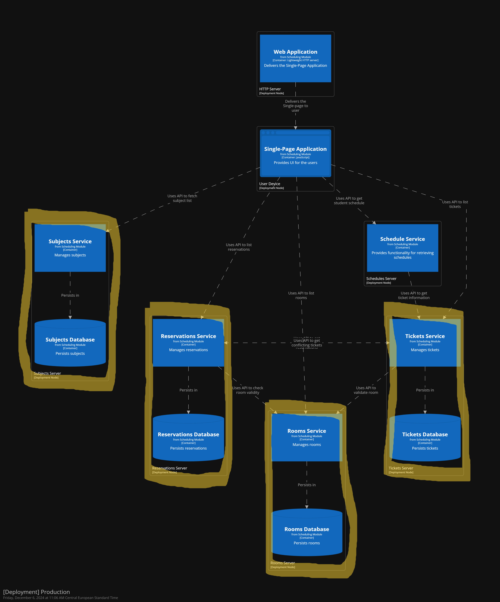

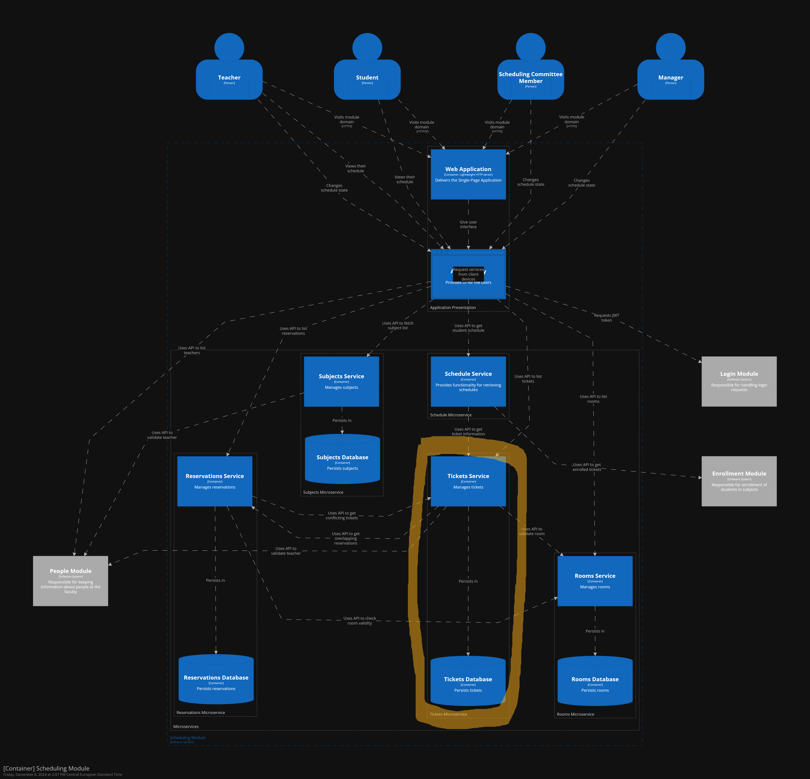

- Scenario 2 (availability): we want to keep using the system when the app is updating (Scale up some services)

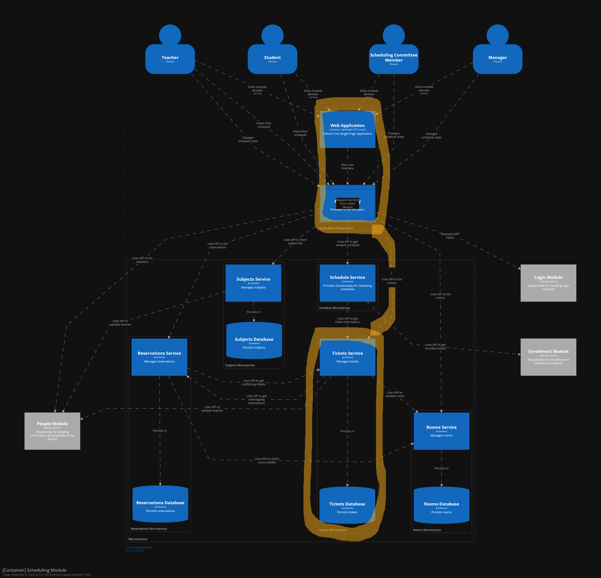

- Scenario 3 (Performance): User unable to access Ticket Service

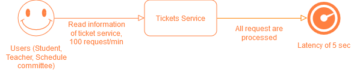

- Problem 1: it is not possible to just scale a database by itself since it is pair with application server or the other way around with application server scaling.

- Problem 2: downtime on the server mean the services and database are both down.

## Propose solution

+ Solution 1: without changing the architecture:
   - Put Tickets Service on Kubernetes and make multiple replica, synchronization should be handled by Kubernetes
   - Problem 1 still persist
   - Problem 2 can be avoided since update some parts of replica while keeping other part running

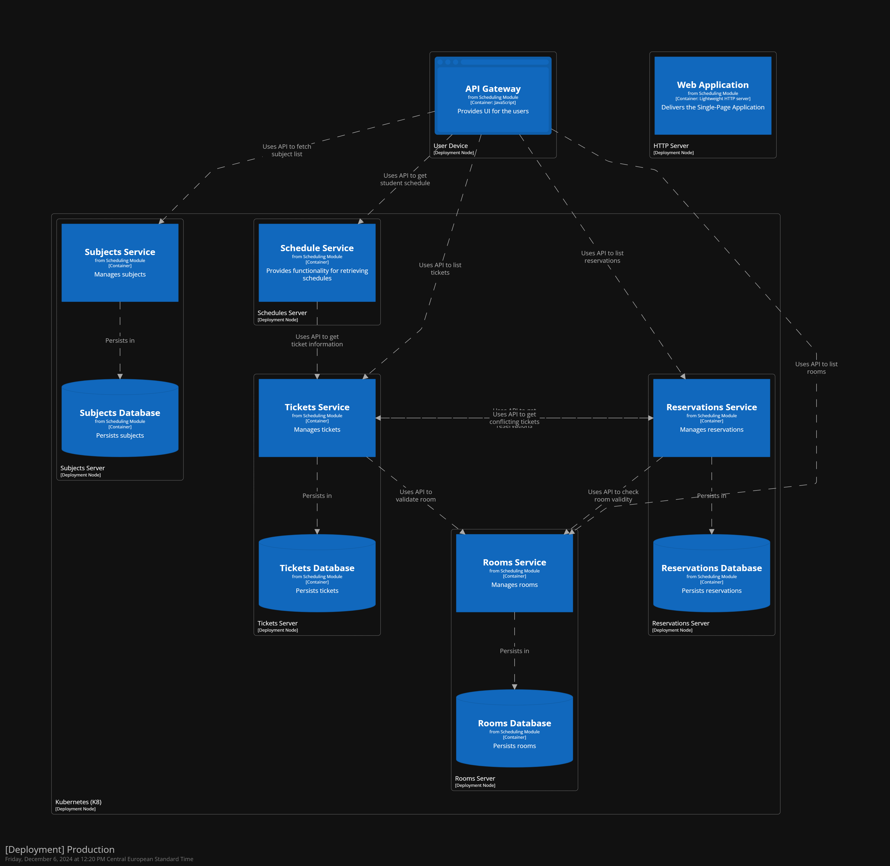

+ Solution 2(scalability): separate the application services and databases in the structure
   - By doing this we can scale each service or database without worry about affecting others.
   - Availability is high since only 1 service is down at a time with database cache service.
   - Problem 1 and 2 solved

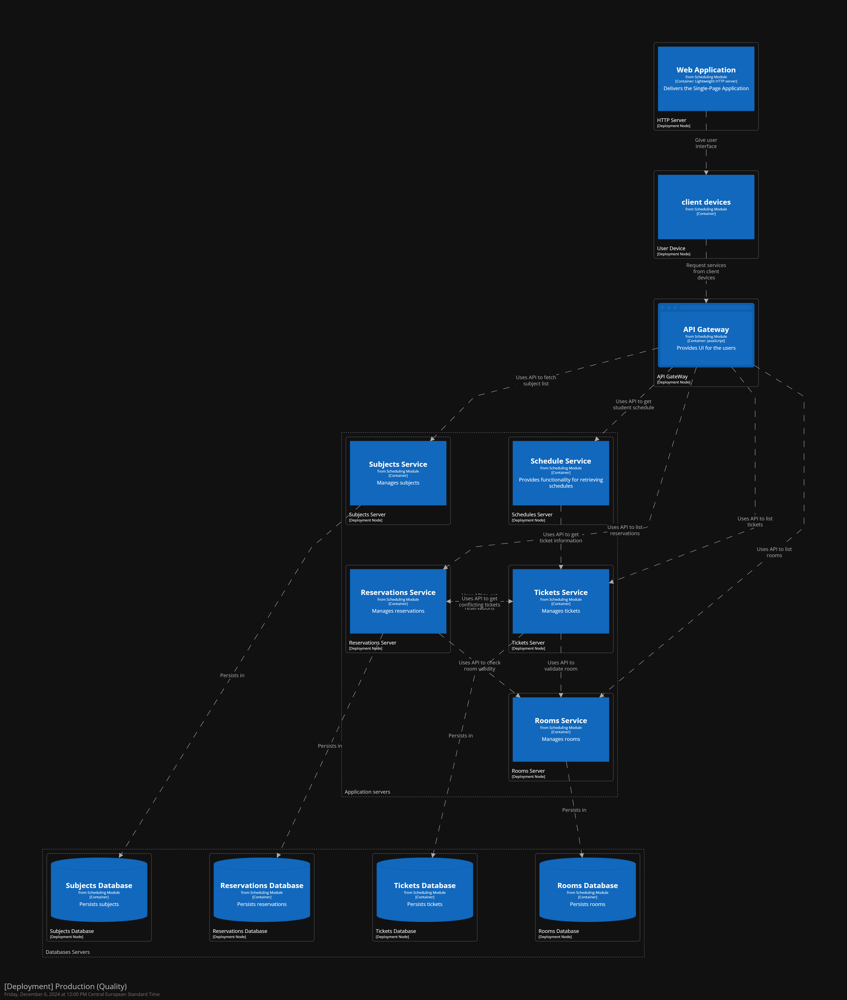

+ Solution 2.0(Availability & Performance): use solution 2 and put it on Kubernetes

   - increase the availability of the system with kubernetes loadbalancing. Also reduce stress on server.

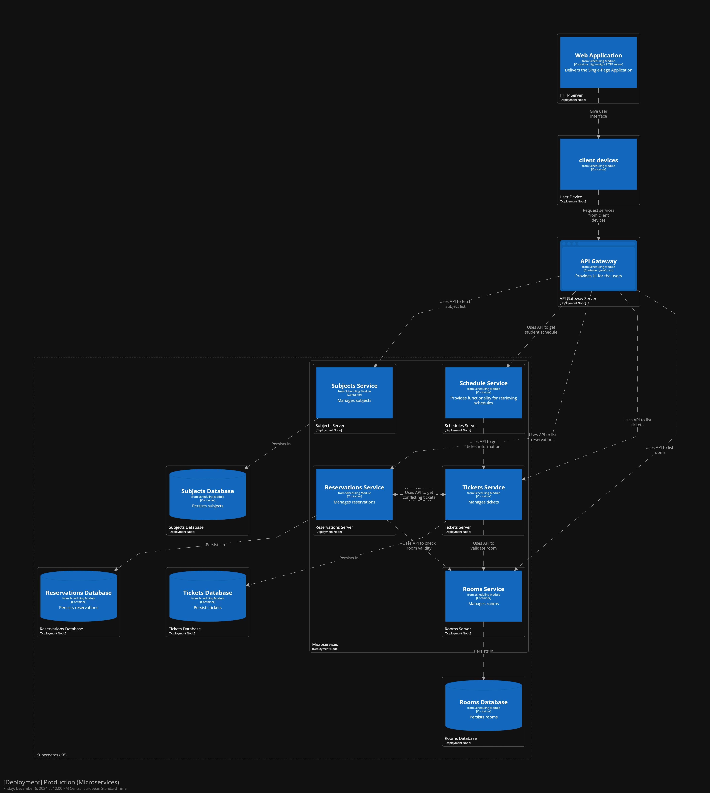

# Vitek
1. Ping/Heartbeat check on People Module 
   - new container
   - cached it
2. Ping/Heartbeat check on Enrollment Module (Since both of them are the same)

# Ivan
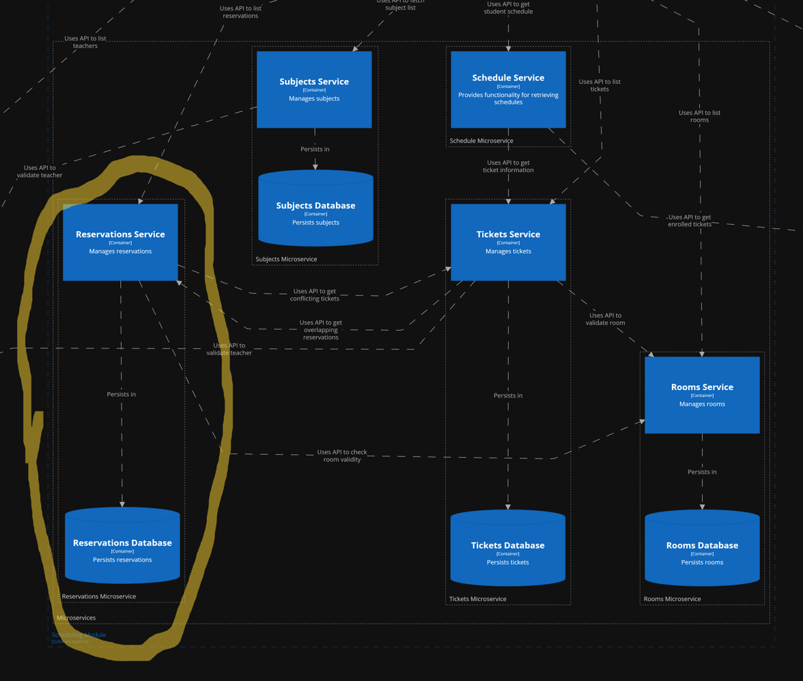
1. Modifiability 
- Scenario: We want to add subscription feature for the room reservation

+ Actually, system can handle this situation fine due to its architecture. We can just add a new microservice.
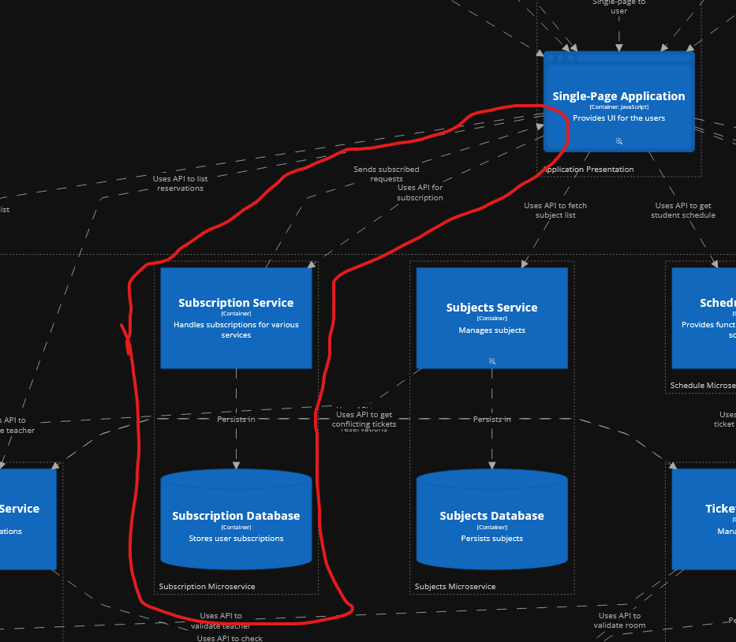

2. Testability
- Scenario: We want to test some new reservation feature

+ Solution 1: Container has already have API Interface, which makes it available to test feature with data at our test environment.
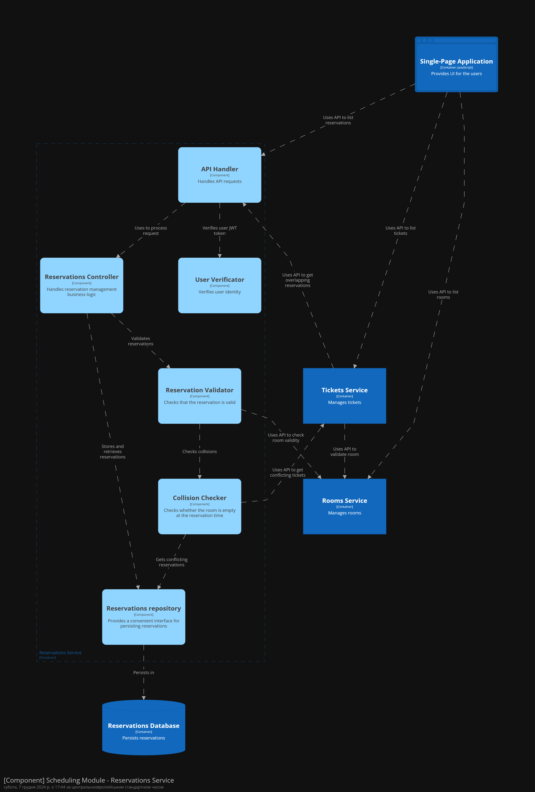
Solution 2: We can add custom logger that will gather information like input, output, container state
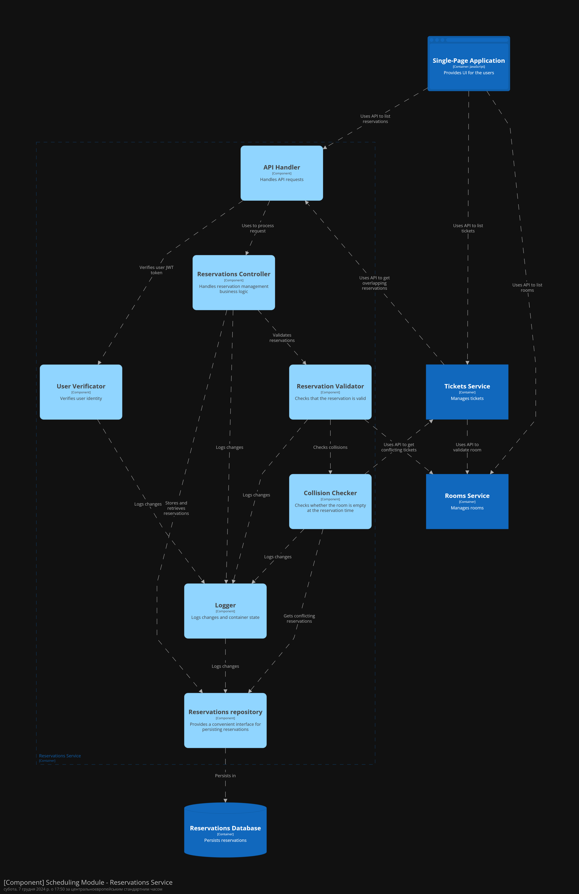
