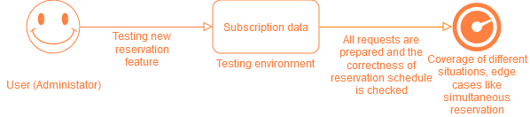

# Betse

Tight Coupling Between Frontend and Backend Services

UI components, such as individual pages, directly call specific backend APIs (e.g., singlePSubjectsPage -> subjectAPIHandler, singlePCreateTicketPage -> ticketAPIHandler).

Each frontend component explicitly interacts with individual microservices instead of delegating these requests to a central API gateway.

Impact on Quality Attributes
Maintainability:

Impact: Changes in backend APIs or microservices (e.g., renaming an endpoint, modifying data structures) will require corresponding updates in the frontend code. This increases the effort for maintenance and reduces the ability to independently evolve services.

Scalability:

Impact: Tight coupling can limit scalability. Adding new features or making major updates often requires simultaneous changes across multiple layers (UI, API handlers, controllers). This slows down development cycles.

Performance:

Impact: With frontend components making multiple, granular API calls (e.g., fetching lists of subjects, rooms, and teachers separately), network latency and the number of requests increase. This could degrade the user experience.

Testability:

Impact: Testing becomes more complex due to direct coupling. Changes in backend APIs require integration tests for both backend and frontend layers.

## proposed soultion

Introduce an API gateway to act as a single entry point for frontend requests. The gateway can aggregate data from multiple services, simplifying frontend logic.

# Both
1. Load balancing on the architecture (change C4)
   - not cluster (kubernetes) cause node is just a PC
2. Server deployment diagram for all microservice for scalability

## Scenario for load balancing (Scalability)

- Scenario 1 (scalability): we want to scale up on Tickets Database

current architecture

- Scenario 2 (availability): we want to keep using the system when the app is updating (Scale up some services)

- Scenario 3 (Performance): User unable to access Ticket Service

- Problem 1: it is not possible to just scale a database by itself since it is pair with application server or the other way around with application server scaling.

- Problem 2: downtime on the server mean the services and database are both down.

## Propose solution

+ Solution 1: without changing the architecture:
   - Put Tickets Service on Kubernetes and make multiple replica, synchronization should be handled by Kubernetes
   - Problem 1 still persist
   - Problem 2 can be avoided since update some parts of replica while keeping other part running

+ Solution 2(scalability): separate the application services and databases in the structure
   - By doing this we can scale each service or database without worry about affecting others.
   - Availability is high since only 1 service is down at a time with database cache service.
   - Problem 1 and 2 solved

+ Solution 2.0(Availability & Performance): use solution 2 and put it on Kubernetes

   - increase the availability of the system with kubernetes loadbalancing. Also reduce stress on server.

# Heartbeat [Vitek]
## External module monitoring
Let's take people module for example.
- It's an external system.
- We cannot manage it/restart it if something goes wrong.

Scenario: People Module is down
Our main system can't work because it's missing mandatory data from people module e.g. whole system goes down if people module goes down.

Solution:
We cache people module into local database. Now the cacher can satisfy people-module related requersts,
even if people module itself goes down.

Caveats:
- People-module could hold subsetially large data and it's caching might require too much (disk) space
- People-module databases might be specificly designed for fast access and having put cacher directly inbetween might cause unreasonable slowdown
- Current understanding of the system is people-module hold mostly static data, should it change in future and hold more dynamicly changing data caching it might have unforeen, undesireble side-effects

## Local module monitoring/restarting
As noted in deployment diagram we are deploying on "dumb" servers which have no `system for restarting on critical error` features,
though we want solve that here we will at least detect that server/service is down an create an alert.

Scenario: subject service goes down

Calls (from single page application) now go unresolved because service crashed and **nobody knows about it**

Solution:
- Running Prometheus as part of the for Logging system
- Running (prometheus) exporters as part of each `deployment node`, these can trigger (prometheus) alert on bad behaivor
- Running hourly heartbeat checks on all services

Caveats:
- who monitors the monitor

<!-- 1. Ping/Heartbeat check on People Module -->
<!--    - new container -->
<!--    - cached it -->
<!-- 2. Ping/Heartbeat check on Enrollment Module (Since both of them are the same) -->

# Ivan

1. Modifiability
- Scenario: We want to add subscription feature for the room reservation

+ Actually, system can handle this situation fine due to its architecture. We can just add a new microservice.

2. Testability
- Scenario: We want to test some new reservation feature

+ Solution 1: Container has already have API Interface, which makes it available to test feature with data at our test environment.

Solution 2: We can add custom logger that will gather information like input, output, container state

